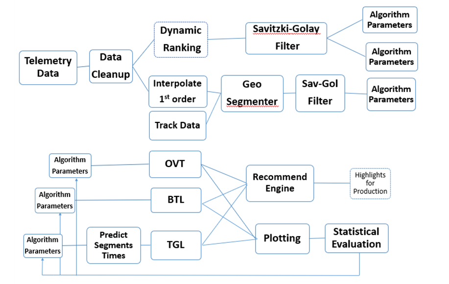
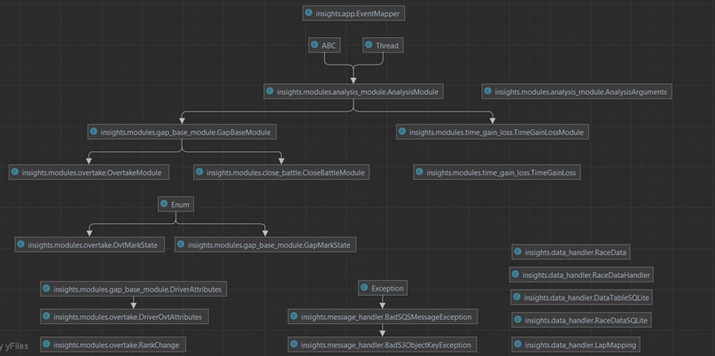

# TAU-racing-project-docs

Data Analysis service repository for generating Griiip's racing events mapping:
Overtakes, Battles and Time Gain/Loss

[for internal executing instruction see the execution section below]

# Documentation

For general overview and implementation, please see [The project book](resources/final-project-book-205846488.pdf)

Facing multiple engineering challenges of signal processing, data engineering, algorithms, research, hypothesis, testing and visualization,
the essence of the project is using signal processing methods and race logic to implement three racing data analysis algorithms, shown in the following diagram, and will be described in detail in this book: Overtakes, Battles, and Errors (Time Gains and Loss)


Block diagram of the project workflow

To understand the project’s software architecture, 
we will first look at overview of the UML class diagrams, showing relations, abstraction, and modularity


UML class diagrams

## Main classes

###  Analysis Module
The `AnalysisModule` is an abstract python class serves as a base class for specific racing analysis modules that inherit from it.
The class extends the `Thread` class. 

#### Usage
The `AnalysisModule` class serves as a base class for specific analysis modules that inherit from it. To create a custom analysis module, follow these steps:

1. Import the necessary modules and classes:
```
import logging
import os
from dataclasses import dataclass
from threading import Thread
from typing import Optional
from abc import ABC, abstractmethod
from griiip_utils.db import RedshiftClient
```

2. Create an instance of the `AnalysisArguments` data class to define the analysis arguments:
```
@dataclass
class AnalysisArguments:
    post_results: bool = True
    delete_prev_marks: bool = True
    plot_results: bool = False
    plot_path: Optional[str] = None
```

3. Define your custom analysis module class that inherits from `AnalysisModule`:
```python
class CustomAnalysisModule(AnalysisModule):
    def __init__(self, session_id: int, db: RedshiftClient, args: AnalysisArguments):
        super().__init__(session_id, db, args)

    def _run(self):
        # Implement the main analysis logic here
        # This method will be executed when the analysis module is run

    def post(self):
        # Implement any post-analysis actions here
        # This method will be executed if post_results argument is set to True

    def plot(self):
        # Implement any plotting or visualization logic here
        # This method will be executed if plot_results argument is set to True
```

4. Instantiate your custom analysis module and provide the necessary parameters:
```python
# Example usage
session_id = 123  # The ID of the racing session
db = RedshiftClient()  # An instance of the RedshiftClient for database operations
args = AnalysisArguments()  # Customize the AnalysisArguments based on your needs
custom_analysis = CustomAnalysisModule(session_id, db, args)
```

5. Run the analysis module by starting the thread:
```python
custom_analysis.start()
```

6. The analysis module will execute the `_run()` method, perform any post-analysis tasks if enabled, and generate plots if specified.

### Documentation of `AnalysisModule` Class

The `AnalysisModule` class contains the following methods and attributes:

### Constructor
- `__init__(self, session_id: int, db: RedshiftClient, args: AnalysisArguments)`: Initializes an instance of the `AnalysisModule` class. It takes the `session_id` as the identifier for the racing session, `db` as the RedshiftClient instance for database operations, and `args` as the analysis arguments.

### Methods
- `_run(self)`: An abstract method that needs to be implemented by derived classes. It contains the main logic of the analysis module and will be executed when the analysis module is run.
- `post(self)`: An abstract method that needs to be implemented by derived classes. It performs any necessary post-analysis actions. This method will be executed if the `post_results` argument is set to True.
- `plot(self)`: An abstract method that needs to be implemented by derived classes. It contains the logic for generating plots or visualizations. This method will be executed if the `plot_results`


## Gap Analysis Module

The `GapBaseModule` is designed to identify and analyze gaps between drivers during a racing session. This module utilizes the ranking data and shares common functionality of gap related analysis that is used with the battle and overtake modules.
 
In addition, there are some classes as the data handler that handle the processing and exceptions classes, as well as data classes as for driver attributes (metadata).

### Usage

1. Import the necessary classes and modules:

```python
import logging
import pandas as pd
from griiip_utils.db import RedshiftClient
from analysis_module import AnalysisModule, AnalysisArguments
```


4. Define the Gap Analysis Module:

```python
class CostumGapAnalysisModule(GapBaseModule):
    def __init__(self, session_id: int, db: RedshiftClient, args: AnalysisArguments, ranks_df: pd.DataFrame,
                 start_lap: Optional[int] = None, last_lap: Optional[int] = None):
        # Initialize the Gap Analysis Module
        super().__init__(session_id, db, args, ranks_df, start_lap, last_lap)
        self.module_code = 'CODE'

    def get_data(self):
        # Retrieve the ranking data for analysis
        pass
        ...

    def filter_data(self) -> pd.DataFrame:
        # Filter the ranking data based on start and last lap parameters
        pass
        ...

    def process_ongoing_marks(self, ranks):
        # Process the ongoing gap marks with the current rankings
        pass
        ...

    def remove_finished_marks(self):
        # Remove the completed and false gap marks from the ongoing marks
        pass
        ...

    def find_new_marks(self, ranks, mark_class: ClassVar, time_gap_threshold: float):
        # Find new potential gap marks
```

# Execution

### Run

* Run `docker-compose build` to build the containers
* Run aws configure
    - enter your aws credentials
* Run `docker-compose up` to run the Insights Service

### Terminating
* Due to the fact that the `restart` keyword in the docker-compose is set to `unless-stopped`
the containers will keep running unless specified to stop*

* Run `docker-compose down` to stop and remove the containers

### .env Variables:
  - `API_ADDRESS` - Griiip API url
  - `API_KEY` - Griiip API Key from AWS
  - `SQS_QUEUE_NAME` - AWS SQS queue name
  - `ENV_NAME` - `prod` or `test`

see `demo.env` for an example .env file

### Tests
* Run `python -m pytest tests` to run all tests
